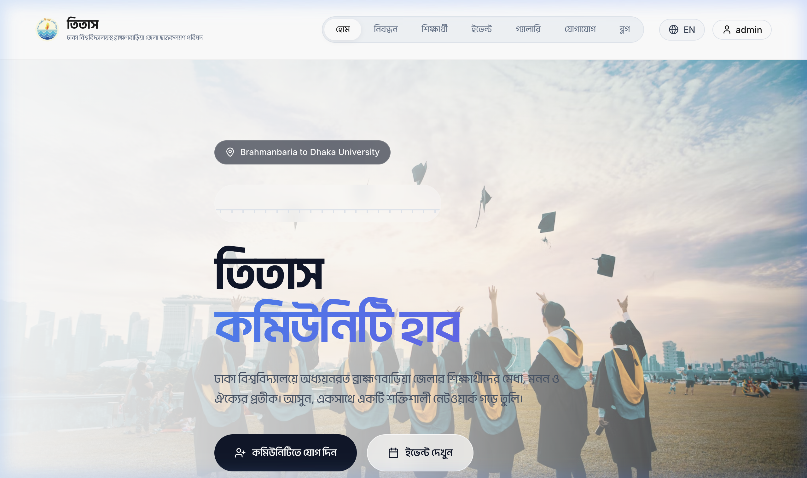
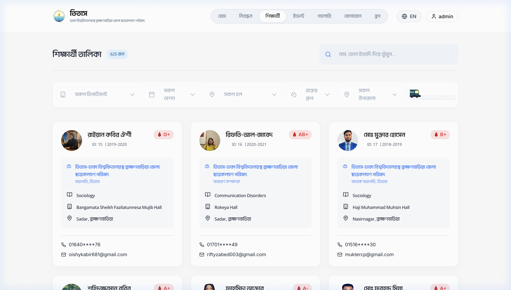
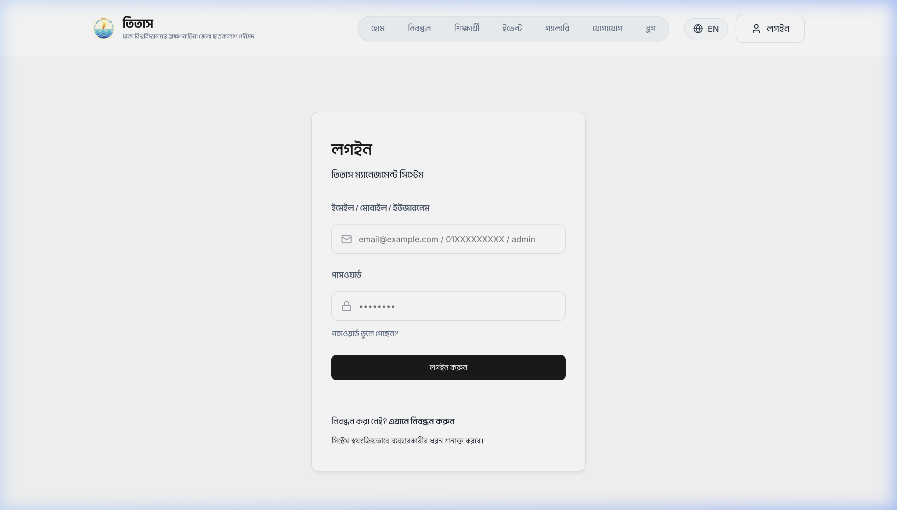
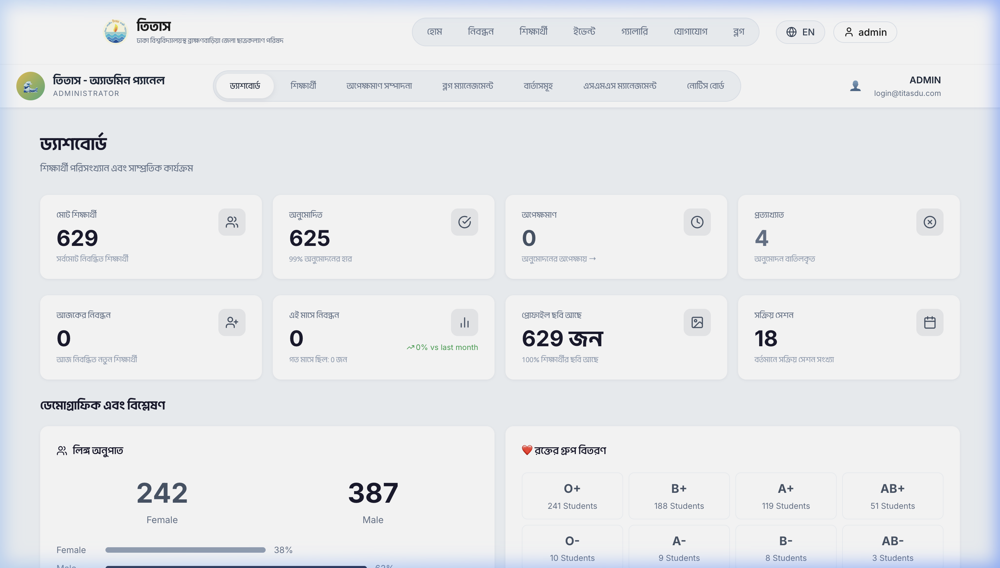
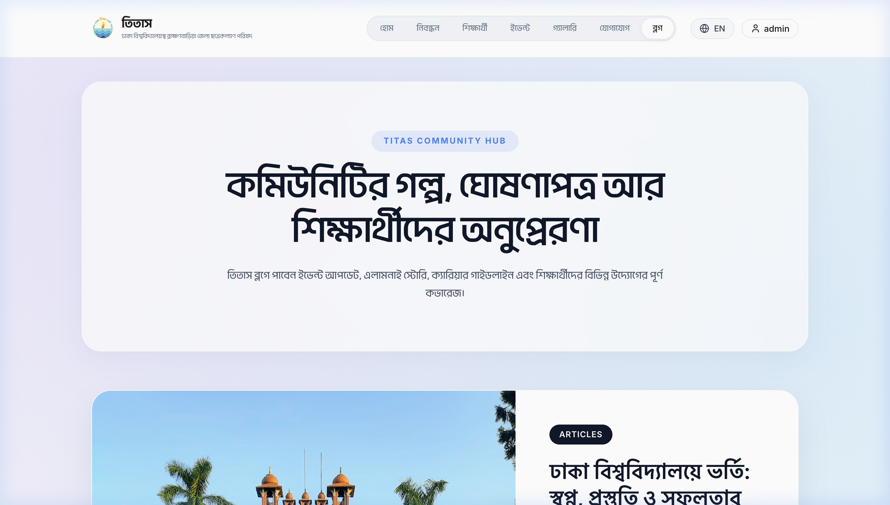

# Titas DU Student Portal

Community platform for Dhaka University students from Brahmanbaria (Titas), built with React, Node.js, Express, and MongoDB.

## Overview

This project includes:
- A public-facing website (home, blog, contact, events, gallery, student directory)
- A protected admin area (content management, student approvals, inbox/messages)
- A backend API with MongoDB storage

## Core Features

### Student Directory
- Search by name, registration number, or phone
- Profile details (department, session, hall, batch)
- Privacy-minded phone masking on server side

### Blog and Content
- Rich text blog posting with media support
- Categories and tags
- Social-share friendly preview endpoint

### Notices and Communication
- Scrolling urgent notice ticker on homepage
- Contact form with admin-side message management

### Events, Gallery, Community
- Public event listing and gallery
- Executive committee and testimonials sections
- Responsive homepage components

### Admin Panel
- Approve/manage students
- Manage blog posts, notices, events, gallery items
- Review incoming contact messages

## Tech Stack

- Frontend: React, Vite, React Router, Axios, Lucide Icons
- Backend: Node.js, Express, Mongoose
- Database: MongoDB
- Auth/Security: JWT, bcrypt

## Prerequisites

- Node.js 18+
- npm
- MongoDB (local or remote)

## Environment Variables

Create backend/.env with at least:

| Variable | Required | Example |
|---|---|---|
| PORT | No | 5010 |
| MONGO_URI | Yes | mongodb://127.0.0.1:27017/titas_clone |
| JWT_SECRET | Yes | change_this_secret |
| FRONTEND_URL | No | http://localhost:5173 |
| BACKEND_URL | No | http://localhost:5010 |

## Local Development

1. Clone and install dependencies

```bash
git clone https://github.com/Shahiduzzaman-Robin/Titas.git
cd Titas

cd backend && npm install
cd ../frontend && npm install
```

2. Start backend

```bash
cd backend
npm run dev
```

3. Start frontend (new terminal)

```bash
cd frontend
npm run dev
```

## Default Local URLs

- Frontend: http://localhost:5173/
- Backend: http://localhost:5010/
- API sample: http://localhost:5010/api/blog/posts

## Available Scripts

### Backend
- npm run dev
- npm start
- npm run seed:blog-demo

### Frontend
- npm run dev
- npm run build
- npm run preview

## API Route Groups

- /api/students
- /api/admin
- /api/blog
- /api/contact
- /api/notices
- /api/gallery
- /api/events

Share/preview route:
- /share/blog/:slug

## Recent Updates (March 10, 2026)

- Redesigned homepage Alumni Spotlight section
- Improved dark-section contrast and card readability
- Added alumni impact stat chips
- Improved mobile spacing and typography for spotlight cards
- Corrected CTA text to Explore Alumni Directory
- Updated project documentation and run instructions

## Screenshots

### Home Page


### Student Directory


### Login


### Admin Dashboard


### Blog


Developed as part of the Titas DU digital transformation effort.
