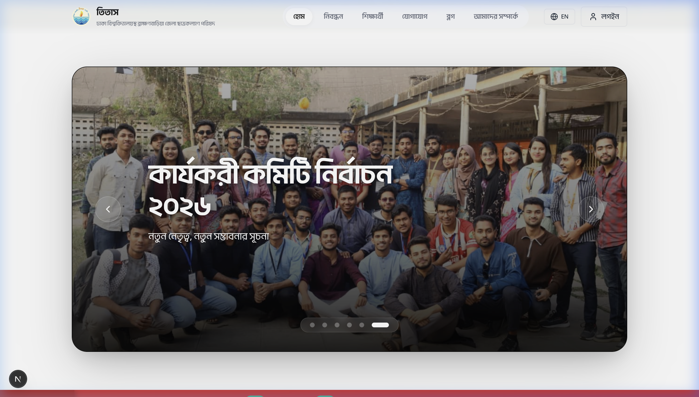
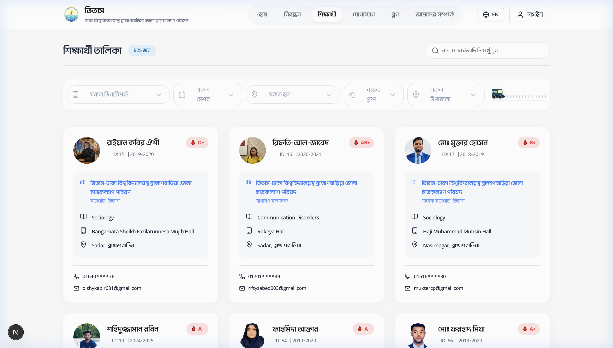
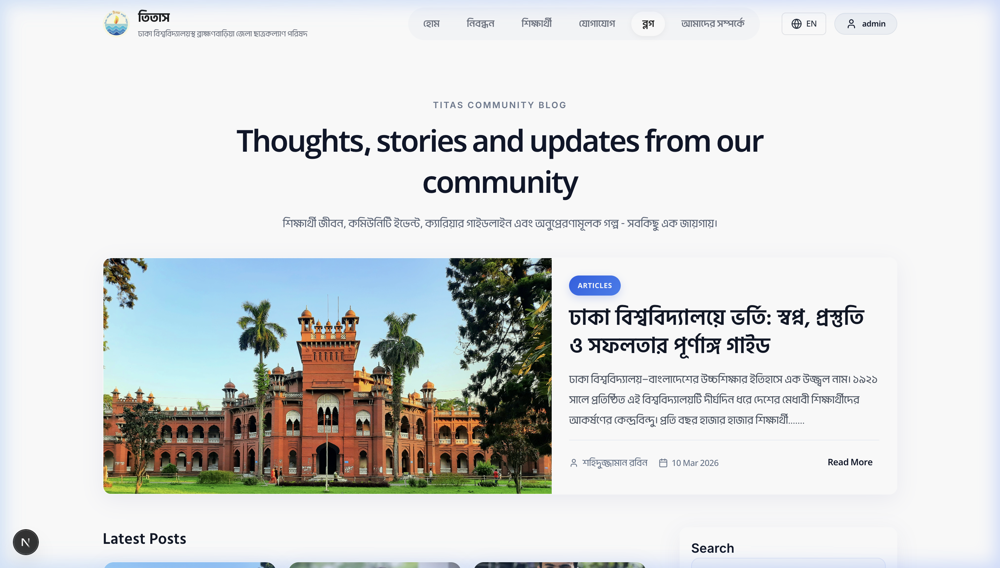
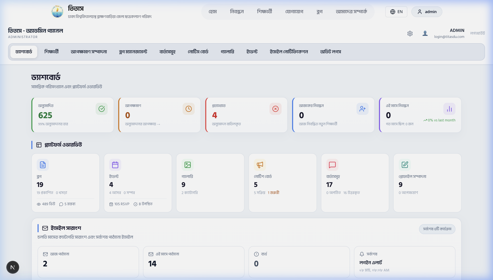
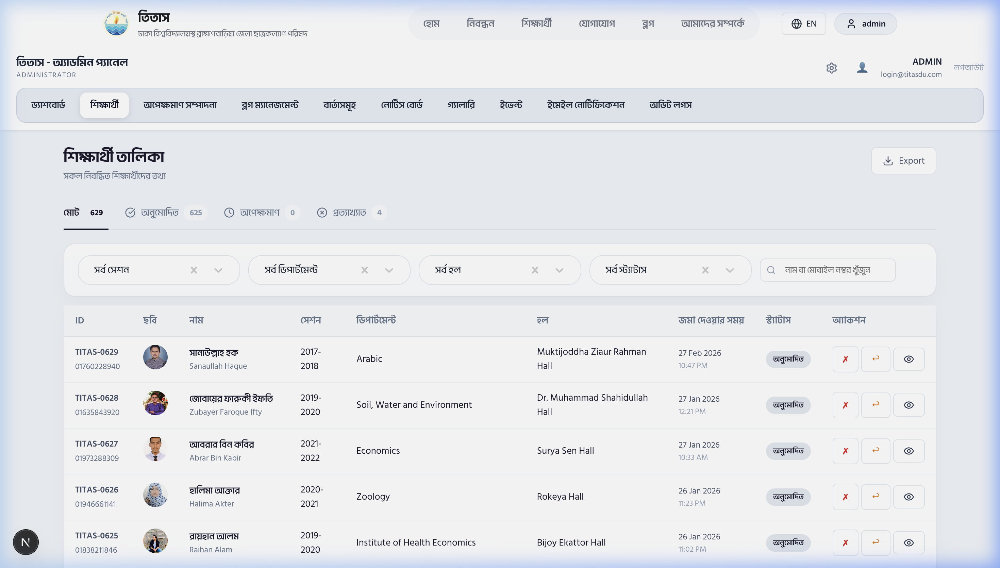
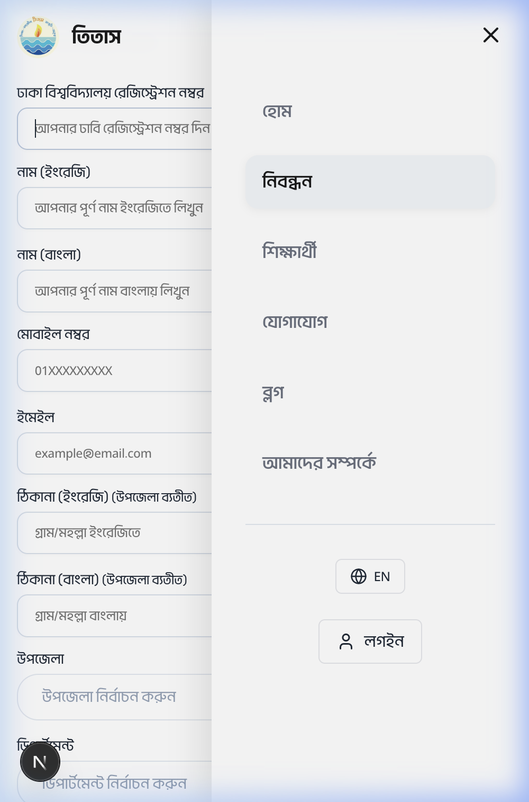

# 🌊 Titas Community Hub | পূর্ণাঙ্গ ডিজিটাল প্লাটফর্ম

[](https://nextjs.org/)
[](https://reactjs.org/)
[](https://expressjs.com/)
[](https://www.mongodb.com/)

**তিতাস (Titas)** is a premium, high-performance community management ecosystem designed for **Dhaka University students and alumni from Brahmanbaria**. Migrated from a legacy SPA to a modern **Next.js 15+ App Router** architecture, it offers lightning-fast performance, superior SEO, and a sophisticated admin infrastructure.

---

## ✨ Key Features & Visual Summaries

### 🎡 Modern Cinematic Slider
A lightweight, high-performance custom carousel featuring **glassmorphism** controls, infinite seamless looping, and cinematic shadows.


### 👥 Advanced Student Directory
A fully searchable and filterable directory with real-time API integration. Supports masked mobile numbers and privacy-first data handling.


### ✍️ Premium Blog Engine
Full-featured journalism platform with dynamic SEO meta tags (OpenGraph), view counting, and a specialized rich-text editor for administrators.


### 📚 Cinematic Reading Experience
Distraction-free, centered reading layout with elegant glassmorphism containers and refined typography.


---

## 🔐 Advanced Admin Panel (Superpower)

The Titas Admin Panel provides a robust command center for community moderators.

### 📊 Main Dashboard
Real-time statistics on student registrations, blog performance, and pending membership requests.


### 📂 Comprehensive Management
- **Student Management**: Approve/reject registrations, update profiles, and manage status with a professional table interface.
- **Blog & News**: Full CRUD with ReactQuill integration for high-quality content production.
- **Notices & Events**: Keep the community informed with real-time notice boards and event tracking.


---

## 📱 Mobile-First Excellence
Every component is meticulously tuned for mobile viewports using `clamp()` typography and adaptive layouts. The profile menu is now fully accessible on all devices.


---

## 🛠 Tech Stack

### Frontend (Next.js 15+)
- **React 19**: Leveraging the latest concurrent features.
- **App Router**: Optimized server-side rendering and static generation.
- **Typography**: Optimized local font delivery (**SolaimanLipi**, **Hind Siliguri**, **Li Ador Noirrit**).
- **Styling**: Vanilla CSS3 + Modern CSS Variables (Theming) & Glassmorphism.

### Backend (Robust)
- **Node.js & Express.js**: High-availability API server.
- **MongoDB**: Flexible NoSQL document storage.
- **JWT**: Secure, stateless authentication.

---

## 📂 Project Structure

```bash
├── backend/                # Express API Server (Port 5010)
├── frontend-next/          # Modern Next.js Application (Port 3000)
│   ├── app/                # App Router (Pages, Layouts, API Routes)
│   ├── components/         # Reusable UI Components
│   ├── public/             # Static Assets, Local Fonts & Desktop Images
│   └── styles/             # Modular & Global CSS
├── docs/                   # Documentation & README Assets
│   └── screenshots/        # High-Resolution UI Screenshots
└── legacy-react-frontend/  # Archived Original SPA
```

---

## 🚀 Installation & Rapid Setup

### Prerequisites
- Node.js 18.x+
- MongoDB 7.0+ (Local or Remote)

### 1. Backend Setup
```bash
cd backend
npm install
# Configure your .env (sample provided)
npm run dev
```

### 2. Frontend Setup
```bash
cd frontend-next
npm install
npm run dev
```

Visit [http://localhost:3000](http://localhost:3000) to view the portal.

---

## 🔒 Security & Optimization
- **Privacy Masking**: Automated data protection for student contact info.
- **Hydration Protection**: Built-in immunity to browser-extension-induced DOM mismatches.
- **Performance**: 100% Next.js Image optimization for rapid LCP.

---
**Developed with ❤️ by [Shahiduzzaman Robin](https://github.com/Shahiduzzaman-Robin)**
